## ANTONIO MARCELO BRITO BARBOSA  RA: 1460482121024

## WCAG - Web Content Acessibility Guidelines
A partir do foco em acessibilidade, o WCAG procura atingir um grupo extenso de pessoas com as mais variadas demandas. Por isso, trata-se de um documento amplo e que considera um número extenso de medidas adotáveis para qualificar a acessibilidade de determinado portal.

Em um dos seus pontos, por exemplo, o registro define os recursos que devem ser aplicados na inclusão de usuários cegos na política de acessibilidade do seu website, delimitando a utilização de descrições ALT como imprescindível para o sucesso. Mas o documento também considera daltônicos, pessoas com deficiência auditiva e de fala etc.

O WCAG ocupa posição de destaque entre os recursos mais valiosos que uma empresa pode ter em mãos durante o processo de construção de um endereço na internet. Especialmente se o objetivo principal está voltado à criação de uma página abrangendo todos os públicos com o máximo de sucesso.

## 1. Percepcionável
As informações e os componentes da interface do usuário devem ser apresentáveis aos usuários de maneiras que possam perceber.

### 1.1 Alternativas de texto
Conforme a sequência da própria WCAG, este é o critério de sucesso "1.1.1 - Conteúdo não textual" que trata justamente de como podemos aplicar alternativas em texto para conteúdos que não são apresentados originalmente como textos.

Por que o critério existe?
Descrever QUALQUER conteúdo visual é altamente importante para que todos possam entender o que está sendo apresentado, principalmente levando em consideração que recursos visuais são amplamente utilizados por designers para compor layouts e telas.

# Aplica
<section align="center">
    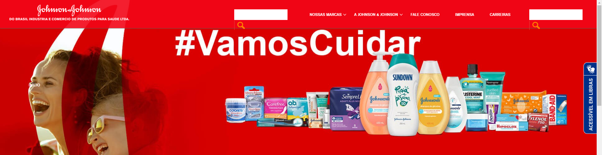
</section>

# Não aplica
<section align="center">
    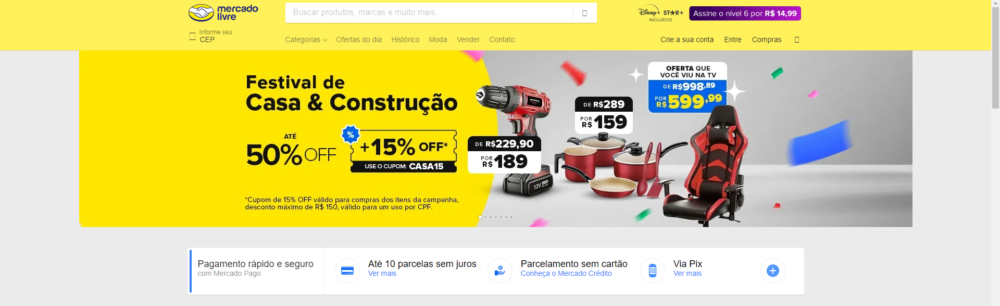
</section>

### 1.2 Mídia baseada no tempo
Forneça alternativas para mídia baseada no tempo.

Qualquer conteúdo pré-gravado que contenha uma faixa de áudio (seja apenas áudio ou vídeo) deve possuir legenda. 

#  Aplica
<section align="center">
    
</section>

# Não aplica
<section align="center">
    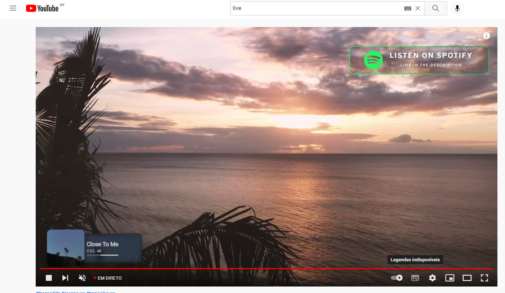
</section>

### 1.3 Adaptável
Crie conteúdo que possa ser apresentado de diferentes maneiras (por exemplo, layout mais simples) sem perder informações ou estrutura.
Um recurso da adaptabilidade é a Orientação.
Alguns sites e aplicativos exigem que os usuários orientem seus dispositivos móveis em modo paisagem ou retrato, em vez de dar-lhes uma escolha. A intenção desse critério de sucesso é garantir que os usuários que não podem rodar facilmente seu dispositivo ainda possam acessar conteúdo e funcionalidade em sites em qualquer orientação do dispositivo.

Um bom exemplo disso é o próprio GitHub que fez o site ser responsivo, isto é, faz com que sua página da web fique bem em todos os dispositivos e ainda se adeque no modo retrato e paisagem.

#  Aplica
# Desktop
<section align="center">
    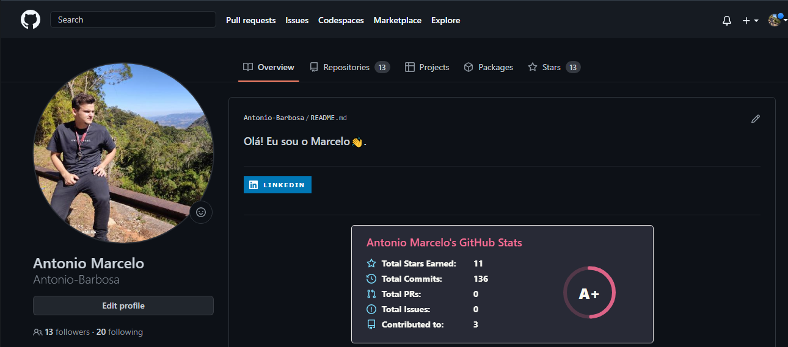
</section>

# Smartphone
<section align="center">
    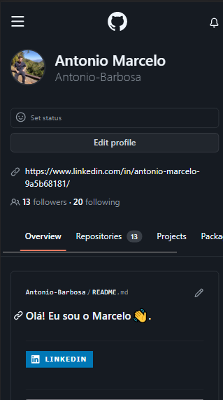
</section>

### 1.4 Distinguível
A intenção deste Critério de Sucesso é garantir que todos os usuários com visão possam acessar informações que são transmitidas por diferenças de cor, ou seja, pelo uso de cor onde cada cor tem um significado atribuído a ela. Se as informações forem transmitidas por diferenças de cor em uma imagem (ou outro formato não-texto), a cor pode não ser vista por usuários com deficiências de cor. Neste caso, fornecer as informações transmitidas com cor através de outro meio visual garante que os usuários que não podem ver a cor ainda possam perceber as informações.

A cor é um importante ativo no design de conteúdo web, aumentando seu apelo estético, sua usabilidade e sua acessibilidade. No entanto, alguns usuários têm dificuldade em perceber a cor. Pessoas com visão parcial muitas vezes experimentam visão de cores limitada, e muitos usuários mais velhos não vêem bem a cor. Além disso, as pessoas que usam displays de cores limitadas ou monocromáticas e navegadores não poderão acessar informações que são apresentadas apenas em cores.

Um bom exemplo desse recurso é quando esquecemos de preencher algum campo obrigatório de um formulário:

<section align="center">
    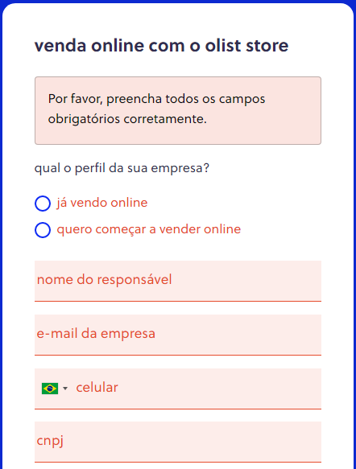
</section>

## 2. Operável
Os componentes da interface do usuário e a navegação devem ser operáveis.

### 2.1 Teclado acessível
Usuários que interagem com seus dispositivos através da fala muitas vezes usam palavras ou strings de letras para fazê-lo. Aplicativos e sites que usam comandos de teclado de letras únicas para ativar funções podem ser frustrantes ou não funcionais para esses usuários, porque ditar uma palavra pode ter consequências totalmente não intencionais. Dar aos usuários a capacidade de desligar, remapear ou limitar a ativação desses atalhos retorna funcionalidade a esses usuários.

Um bom exemplo desse recurso é o uso dos atalhos de teclado: 

<section align="center">
    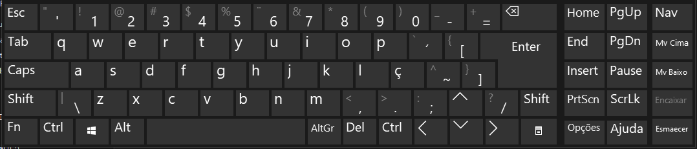
</section>

### 2.2 Tempo suficiente
Forneça aos usuários tempo suficiente para ler e usar conteúdo.
Qualquer elemento na tela que tenha movimento automático ou pisque e que dure mais do que 5 segundos, deve ter um tipo de controle onde a pessoa que o utiliza pode pausar, parar ou ocultar. 

Um bom exemplo desse recurso é o botão de pause que o Youtube oferece: 

<section align="center">
    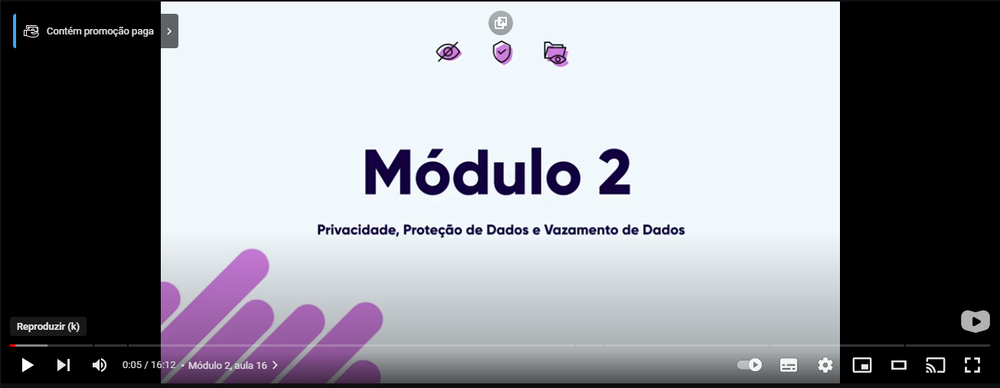
</section>

### 2.3 Convulções e Reações Físicas
Não projete conteúdo de forma conhecida por causar convulsões ou reações físicas.
Nenhum conteúdo da página deve piscar mais que 3 vezes por segundo, a não ser que os flashes estejam em baixo contraste ou possuam pouco vermelho.

### 2.4 Navegável
Fornecer maneiras de ajudar os usuários a navegar, encontrar conteúdo e determinar onde eles estão.
Um mecanismo está disponível para contornar blocos de conteúdo que são repetidos em várias páginas da Web. 

Um bom exemplo disso é o menu do mercado livre, que está presente em todas as páginas que o usuário possa acessar do site.
<section align="center">
    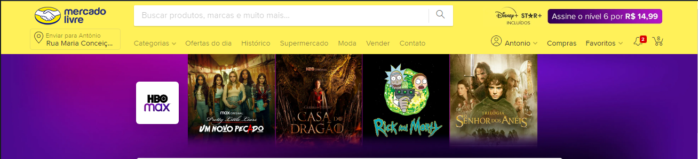
</section>

## 3 - Compreensível

As informações e o funcionamento da interface do usuário devem ser compreensíveis.
### 3.1 Legível

Palavras regionais específicas e nomes próprios costumam ter pronúncias também específicas. Deve ser fornecida uma forma de possibilitar a correta compreensão da pronúncia em alguns casos.

Um bom exemplo disso é o tradutor do goole, que disponibiliza um arquivo de áudio exemplificando como deve ser a pronúncia: 

<section align="center">
    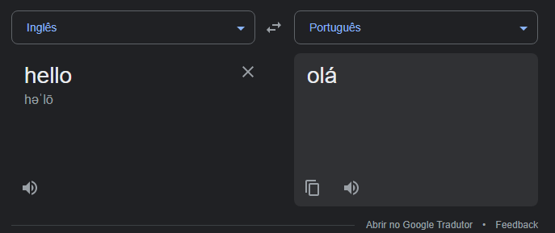
</section>

## 4 - Robusto
O conteúdo deve ser robusto o suficiente para que possa ser interpretado por uma grande variedade de agentes do usuário, incluindo tecnologias assistivas.
### 4.1 Compatível
No conteúdo implementado usando linguagens de marcação, as mensagens de status podem ser determinadas programáticamente por meio de função ou propriedades, de modo que possam ser apresentadas ao usuário por tecnologias assistivas sem receber foco.

Um bom exemplo desse recurso é o WhatsApp, que possibilita o usuário setar quem pode ver sua foto de perfil por exemplo: 

<section align="center">
    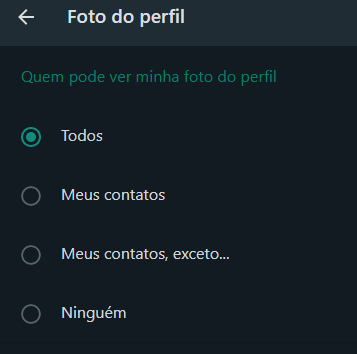
</section>

## Referências
- <a href="https://www.w3.org/WAI/WCAG21/quickref/?showtechniques=129&currentsidebar=%23col_overview#principle1"> Heurísticas </a>
- <a href="https://guia-wcag.com/"> Guia </a>

