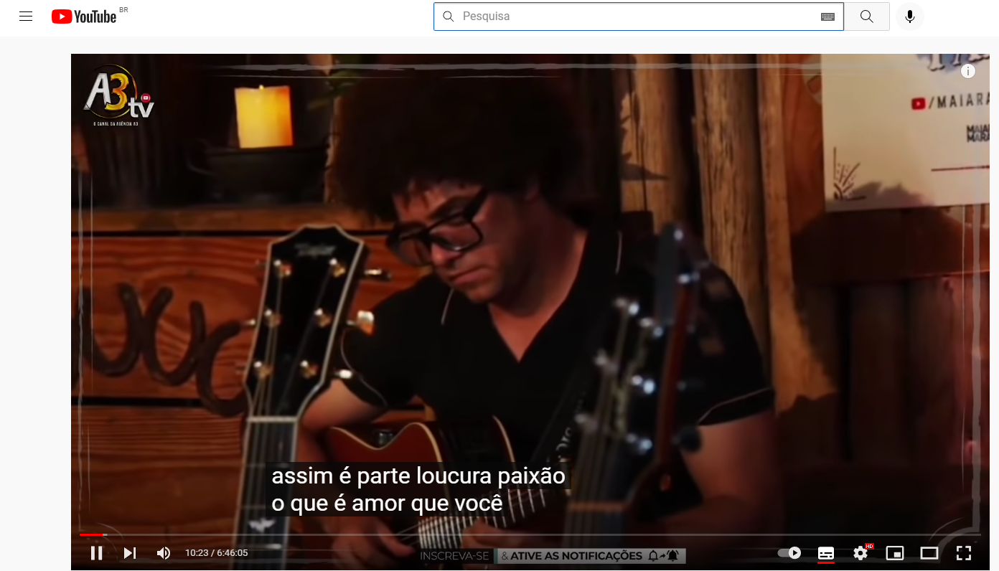

## ANTONIO MARCELO BRITO BARBOSA  RA: 1460482121024

## WCAG - Web Content Acessibility Guidelines
A partir do foco em acessibilidade, o WCAG procura atingir um grupo extenso de pessoas com as mais variadas demandas. Por isso, trata-se de um documento amplo e que considera um número extenso de medidas adotáveis para qualificar a acessibilidade de determinado portal.

Em um dos seus pontos, por exemplo, o registro define os recursos que devem ser aplicados na inclusão de usuários cegos na política de acessibilidade do seu website, delimitando a utilização de descrições ALT como imprescindível para o sucesso. Mas o documento também considera daltônicos, pessoas com deficiência auditiva e de fala etc.

O WCAG ocupa posição de destaque entre os recursos mais valiosos que uma empresa pode ter em mãos durante o processo de construção de um endereço na internet. Especialmente se o objetivo principal está voltado à criação de uma página abrangendo todos os públicos com o máximo de sucesso.

## 1. Percepcionável
As informações e os componentes da interface do usuário devem ser apresentáveis aos usuários de maneiras que possam perceber.

### 1.1 Alternativas de texto
Conforme a sequência da própria WCAG, este é o critério de sucesso "1.1.1 - Conteúdo não textual" que trata justamente de como podemos aplicar alternativas em texto para conteúdos que não são apresentados originalmente como textos.

Por que o critério existe?
Descrever QUALQUER conteúdo visual é altamente importante para que todos possam entender o que está sendo apresentado, principalmente levando em consideração que recursos visuais são amplamente utilizados por designers para compor layouts e telas.

# Aplica
<section align="center">
    
</section>

# Não aplica
<section align="center">
    
</section>

### 1.2 Mídia baseada no tempo
Forneça alternativas para mídia baseada no tempo.

Qualquer conteúdo pré-gravado que contenha uma faixa de áudio (seja apenas áudio ou vídeo) deve possuir legenda. 

#  Aplica
<section align="center">
    
</section>

# Não aplica
<section align="center">
    
</section>

### 1.3 Adaptável
Crie conteúdo que possa ser apresentado de diferentes maneiras (por exemplo, layout mais simples) sem perder informações ou estrutura.
Um recurso da adaptabilidade é a Orientação.
Alguns sites e aplicativos exigem que os usuários orientem seus dispositivos móveis em modo paisagem ou retrato, em vez de dar-lhes uma escolha. A intenção desse critério de sucesso é garantir que os usuários que não podem rodar facilmente seu dispositivo ainda possam acessar conteúdo e funcionalidade em sites em qualquer orientação do dispositivo.

Um bom exemplo disso é o próprio GitHub que fez o site ser responsivo, isto é, faz com que sua página da web fique bem em todos os dispositivos e ainda se adeque no modo retrato e paisagem.

#  Aplica
# Desktop
<section align="center">
    
</section>

# Smartphone
<section align="center">
    
</section>

### 1.4 Distinguível
A intenção deste Critério de Sucesso é garantir que todos os usuários com visão possam acessar informações que são transmitidas por diferenças de cor, ou seja, pelo uso de cor onde cada cor tem um significado atribuído a ela. Se as informações forem transmitidas por diferenças de cor em uma imagem (ou outro formato não-texto), a cor pode não ser vista por usuários com deficiências de cor. Neste caso, fornecer as informações transmitidas com cor através de outro meio visual garante que os usuários que não podem ver a cor ainda possam perceber as informações.

A cor é um importante ativo no design de conteúdo web, aumentando seu apelo estético, sua usabilidade e sua acessibilidade. No entanto, alguns usuários têm dificuldade em perceber a cor. Pessoas com visão parcial muitas vezes experimentam visão de cores limitada, e muitos usuários mais velhos não vêem bem a cor. Além disso, as pessoas que usam displays de cores limitadas ou monocromáticas e navegadores não poderão acessar informações que são apresentadas apenas em cores.

Um bom exemplo desse recurso é quando esquecemos de preencher algum campo obrigatório de um formulário:

<section align="center">
    
</section>

## Referências
- <a href="https://www.w3.org/WAI/WCAG21/quickref/?showtechniques=129&currentsidebar=%23col_overview#principle1"> Heurísticas </a>
- <a href="https://guia-wcag.com/"> Guia </a>

